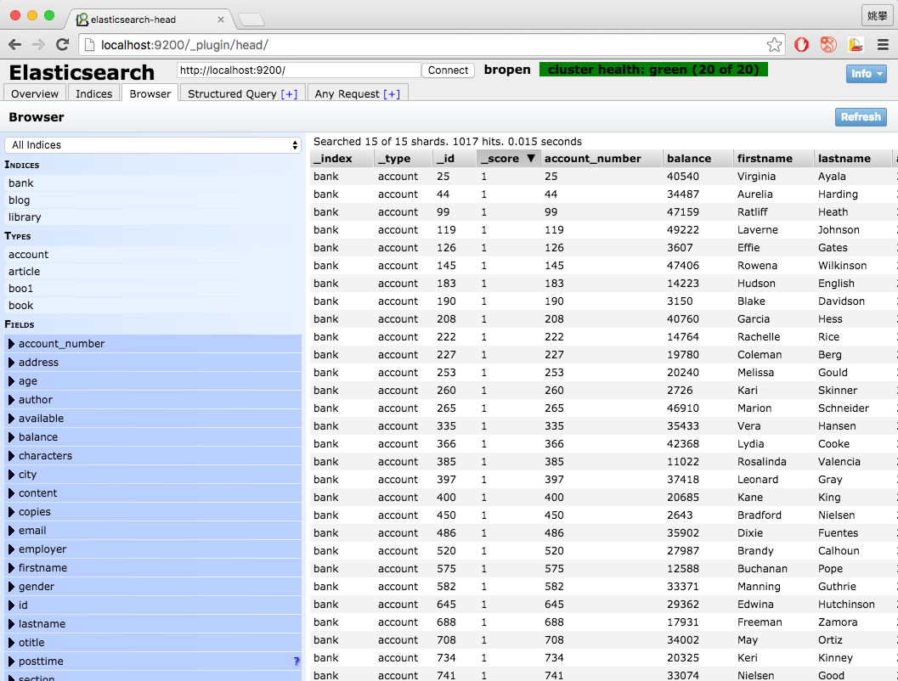

Elasticsearch Data Source
=====
---
##数据格式
本数据包含1000条假想的银行客户账户信息,保存在account.json中,文档具有以下的模式(schema):

	          
	  {
	  	"account_number": 0,
	  	"balance": 16623,
	  	"firstname": "Bradshaw",
	  	"lastname": "Mckenzie",
	  	"age": 29,
	  	"gender": "F",
	  	"address": "244 Columbus Place",
	  	"employer": "Euron",
	  	"email": "bradshawmckenzie@euron.com",
	  	"city": "Hobucken",
	  	"state": "CO"
	  }

##使用说明
下载account.json文件,统一目录下使用curl工具执行以下命令：

	curl -XPOST 'localhost:9200/bank/account/_bulk?pretty' --data-binary @accounts.json
	
执行完毕以后，1000条客户银行账号信息已经索引到elasticsearch中.索引(index)名称为bank,类型(type)为account.之后可以在head插件中浏览，基于该数据集进行查询操作的学习.

